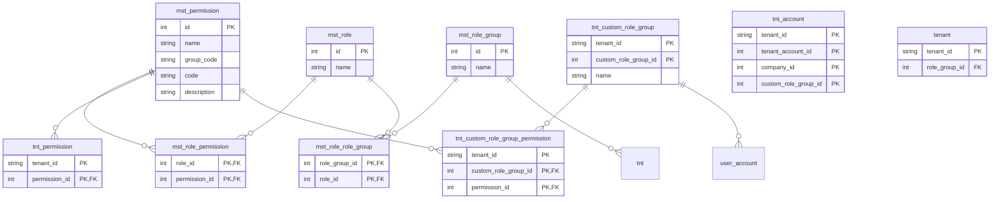
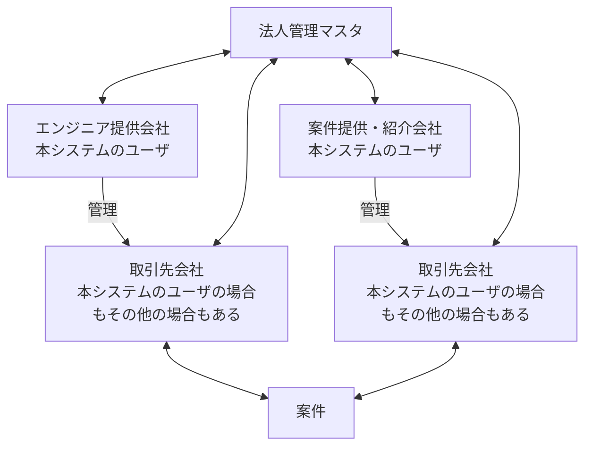

# 機能一覧

## 概要

本ドキュメントは、エンジニア・案件マッチングシステム（chktn）の機能を一覧として整理します。機能カテゴリごとに分類し、各機能の概要、優先度、関連モジュールを明確にすることで、実装の優先順位や範囲を判断できるようにします。

## データベーステーブルについて

### テーブル・カラム命名規則
- テーブル名はスネークケースで単数形とする（例：tnt_user_account）
- テーブル名プレフィックスとして以下を使用する
  - mst_: 全体で管理するマスタ系テーブル
  - tnt_: テナント単位で管理するテーブル
  - cmp_: 会社単位で管理するテーブル
  - usr_: ユーザー単位で管理するテーブル

### デフォルト追加カラム
- 以下のカラムは下記データ構成を書くときには省略する
- 以下のカラムはデフォルトで追加するカラム
  - created_at: 作成日時（データベース側でUTC時刻として自動設定）
  - updated_at: 更新日時（データベース側でUTC時刻として自動設定）
- idとidを紐づかせるような多対多のテーブル以外では原則物理削除はしないので以下カラムを追加（例：mst_role_role_group）
  - is_deleted: 削除フラグ
  - deleted_at: 削除日時（データベース側でUTC時刻として自動設定）

### ID採番ルール
- 公開される一部のデータ以外は原則外部の会社のデータにアクセスすることができない＆IDが公開されないように考慮する
- auto_incrementの自動採番はマスタテーブル以外では原則使用しない
- PKは複数カラム（テナント・会社IDと一緒に結合して使用すること）を基本とする
  - 例）tnt_account
    - tenant_id: テナントID PK
    - tenant_account_id: テナントユーザアカウントID(テナント毎に連番で採番する) PK
    - company_id: 会社ID


## アクター
- システム：システムが自動的に行うアクション
- 管理者：システムの管理者（プラウドの人）ユーザ
- ユーザ：以下に分類 単にユーザと言った場合両方のことを指す
  - エンジニア提供会社： エンジニアを登録して管理する会社で
  - 案件提供会社： 公開案件を登録して管理する会社
    - これらは本システムのユーザであり、エンジニア提供会社と案件提供会社は同じ会社であることもある


## 画面グループ一覧

### 管理者
| 大項目 | 画面グループ | アクター | 概要 |
|--------|--------|--------|------|
| マスタ管理系 | マスタロール管理 | 管理者 | システム全体で使用するロール（役割）を管理する画面 |
| マスタ管理系 | マスタロールグループ管理 | 管理者 | システム全体で使用するロールグループを管理する画面 |
| マスタ管理系 | マスタロールグループロール管理 | 管理者 | ロールグループとロールの紐づけを管理する画面 |
| マスタ管理系 | スキルマスタ管理 | 管理者 | スキルマスタ、スキルカテゴリの検索、追加、編集、削除、追加依頼を行う画面 |
| マスタ管理系 | 法人マスタ管理 | 管理者 | 法人マスタの検索・一覧表示を行う画面 |
| システム管理系 | テナント管理 | 管理者 | テナントの検索、支払い管理、削除を行う画面 |
| システム管理系 | テナント権限管理 | 管理者 | テナントごとに設定できる権限を管理する画面 |
| システム管理系 | リファラー管理 | 管理者 | リファラーの検索、作成、編集、削除を行う画面 |
| システム管理系 | お知らせ管理 | 管理者 | お知らせの検索、作成、編集、削除を行う画面 |
| データ閲覧 | ログ閲覧 | 管理者 | ログを閲覧できる画面 |
| データ閲覧 | リファラー閲覧 | 管理者 | リファラーを閲覧できる画面 |


### ユーザ
| 大項目 | 画面グループ | アクター | 概要 |
|--------|--------|--------|------|
| ログイン前・認証・認可 | LP | ユーザ | LP画面 |
| ログイン前・認証・認可 | 仮登録情報登録 | ユーザ | ユーザの仮登録に必要な情報を登録する画面 |
| ログイン前・認証・認可 | 本登録情報登録 | ユーザ | ユーザの本登録に必要な情報を登録する画面。MFA、アフィリエイト情報登録を含む |
| ログイン前・認証・認可 | ログイン | ユーザ | メールアドレスとパスワードでログインする画面。パスワードリセットメール送信機能を含む |
| ログイン前・認証・認可 | パスワードリセット | ユーザ | パスワードをリセットする画面 |
| トップ画面 | トップ画面ダッシュボード | ユーザ | トップ画面で様座な情報をダッシュボードで表示する画面 |
| アカウント管理 | テナント・会社管理 | ユーザ | テナント情報の編集、会社情報の一覧表示・追加・編集・削除を行う画面 |
| アカウント管理 | アカウント管理 | ユーザ | ユーザアカウントの検索、作成、編集、削除、権限管理を行う画面 |
| テナントマスタ管理 | カスタムロールグループ管理 | ユーザ | テナントごとのカスタムロールグループを管理する画面 |
| テナントマスタ管理 | カスタムロールグループロール管理 | ユーザ | カスタムロールグループと権限の紐づけを管理する画面 |
| テナントマスタ管理 | テキスト値管理 | ユーザ | テキスト値の検索、作成、編集、削除を行う画面 |
| テナントマスタ管理 | メールテンプレート管理 | ユーザ | メールテンプレートの検索、作成、編集、削除を行う画面 |
| テナントマスタ管理 | メーリングリスト管理 | ユーザ | メーリングリストの検索、作成、編集、削除を行う画面 |
| テナントマスタ管理 | メールデフォルト設定管理 | ユーザ | メールデフォルト設定の検索、作成、編集、削除を行う画面 |
| テナントマスタ管理 | お知らせ管理 | ユーザ | 自テナントのお知らせの検索、作成、編集、削除を行う画面 |
| テナントマスタ管理 | 取引先会社管理 | ユーザ | 取引先会社の検索、追加、編集、削除を行う画面 |
| 案件管理 | 案件管理 | ユーザ | 自テナントの案件の検索、追加、編集、削除、スキル管理、公開設定変更、公開範囲管理、エンド会社案件管理を行う画面 |
| メッセージ管理機能 | メッセージ管理 | ユーザ | 案件に対するメッセージの検索、詳細表示、送信、削除、ステータス管理を行う画面 |
| レコメンドマッチング | レコメンドマッチング機能 | ユーザ | 案件とエンジニアがマッチングされた案件の一覧を表示 |


### エンジニア提供会社
| 大項目 | 画面グループ | アクター | 概要 |
|--------|--------|--------|------|
| 面談管理機能 | 公開案件検索 | エンジニア提供会社 | 公開された案件を検索・一覧表示し、詳細表示や面談申し込みを行う画面 |
| 面談管理機能 | エンジニア面談管理 | エンジニア提供会社 | エンジニアと案件の面談情報を登録、検索、編集、削除、ステータス管理、通知・メール送信を行う画面 |
| エンジニア管理機能 | エンジニア管理 | エンジニア提供会社 | エンジニアの検索、登録、一括登録、担当管理、ステータス設定、公開設定、ブラックリスト設定、編集、削除、おすすめ案件検索を行う画面 |
| エンジニア管理機能 | スキルシート管理 | エンジニア提供会社 | スキルシートのアップロード、ダウンロード、全文検索を行う画面 |
| エンジニア管理機能 | スキル管理 | エンジニア提供会社 | エンジニアのスキルの検索、登録、編集、削除を行う画面 |
| エンジニア管理機能 | エンジニア案件管理 | エンジニア提供会社 | エンジニアの案件の検索、エンジニアと案件の紐づけ、編集を行う画面 |


### 案件提供会社
| 大項目 | 画面グループ | アクター | 概要 |
|--------|--------|--------|------|
| 面談管理機能 | 公開エンジニア検索 | 案件提供会社 | 公開されたエンジニアを検索・一覧表示し、詳細表示や面談申し込みを行う画面 |
| 面談管理機能 | 案件面談管理 | 案件提供会社 | 案件とエンジニアの面談情報を登録、検索、編集、削除、ステータス管理、通知・メール送信を行う画面 |


### システム機能グループ
| 大項目 | 機能グループ | アクター | 概要 |
|--------|--------|--------|------|
| テナント・会社・取引先管理 | 法人管理 | システム | APIを使用して法人番号から会社情報を取得するなど |
| 認証・認可 | LP | システム | ランディングページ。紹介者IDのCookie保存と引き回しを行う。トラッキングもする。 |
| 案件管理 | 公開案件管理 | システム | 公開された案件情報のマスキング処理を行う |
| エンジニアスキルシート機能 | スキルシートOCR | システム | 画像PDFなどテキストに変換できない形式の場合はOCRでテキストに変換する |
| エンジニアスキルシート機能 | スキルシート生成AI解析 | システム | スキルシートを生成するAIを使用して解析して、スキルテーブル、プロジェクトテーブルに紐づける |
| エンジニアスキルシート機能 | スキルシート作成AI解析 | システム | テーブルデータからスキルシートを作成する |
| エンジニアスキルシート機能 | スキルシートプレビュー生成 | システム | スキルシートをプレビューできるスキルシートを生成する |
| エンジニアスキルシート機能 | スキルシート全文検索 | システム | スキルシートの内容を全文検索できる |
| 面談管理機能 | おすすめ案件レコメンド | システム | おすすめ案件をレコメンドする |
| 面談管理機能 | おすすめエンジニアレコメンド | システム | おすすめエンジニアをレコメンドする |
| 面談管理機能 | 案件・エンジニアマッチングバッチ処理 | システム | 案件・エンジニアマッチングのバッチ処理を行う |


---

## 認証・認可
  - 初期登録
  - ログイン、ログアウト
  - トークンリフレッシュ


### QRコードからの紹介パターン
```
QRコードからLPページにランディング
   |
LPページの登録開始ボタンクリック
   |
仮登録情報登録
   |
メール送信
   |
本登録情報登録
   |
アフィリエイト情報登録
   |
通知メール・slackメッセージなど送信
   |
ログイン画面でログイン
```

### 他パターン
```
ログイン画面の新規登録はこちら
   |
仮登録情報登録
   |
以下QRコードのパターンと同じ
```

### 機能一覧
| 画面 | 機能名 | 概要 | 優先度 | アクター | 備考 |
|--------|--------|------|--------|--------|--------|
| LP | 紹介者IDCookie保存 | URLパラメタの紹介者のIDをCookieに保存 | 必須 | システム |
| LP | 紹介者ID引き回し | URLパラメタに紹介者のID付加して仮登録情報登録に遷移できるようにする | 必須 | システム |
| 仮登録情報登録 | 登録 | 仮登録に必要な情報を登録 | 必須 | ユーザ |
| 仮登録情報登録 | メール送信 | 入力されたメールアドレスに本登録用のURLを入れてメールを送信 | 必須 | システム |
| 本登録情報登録 | 登録 | 本登録に必要な情報を登録 | 必須 | ユーザ |
| 本登録情報登録 | 携帯電話コード送信 | 入力された携帯電話にコード送信 | 必須 | システム |
| 本登録情報登録 | MFA | 携帯電話に送信したコードを入れてMFA済みであることを記録 | 低 | システム、ユーザ |
| 本登録情報登録 | アフィリエイト情報登録 | アフィリエイト情報をテーブルに登録する | 必須 | システム |
| 本登録情報登録 | 通知メール・slackメッセージなど送信 | 通知メール・slackメッセージなど送信 | 必須 | システム |
| ログイン | ログイン | メールアドレス、パスワードでログイン | 必須 | ユーザ |
| ログイン | パスワードリセットメール送信 | メールアドレスにパスワードリセットのメール送信 | 中 | ユーザ |
| パスワードリセット | パスワードリセット | パスワードを入力してもらって書き換え | 中 | ユーザ |
| リファラー管理 | リファラー検索・一覧表示 | リファラーを検索できて一覧表示できる | 中 | 管理者 |
| リファラー管理 | リファラー作成 | リファラーを作成できる | 中 | 管理者 |
| リファラー管理 | リファラー編集 | リファラーを編集できる | 中 | 管理者 |


### データ構成

**usr_account_temporary: ユーザ仮登録アカウントテーブル: ユーザの仮登録情報を管理するテーブル**
- 最初はメールアドレスのみで登録することを想定
  - token: トークン PK
  - login_mail_address: ログインメールアドレス
  - expires_at: トークン有効期限

**tenant: テナントテーブル: テナント情報を管理するテーブル**
- 同一テナントに複数の会社が紐づく構造にする
  - tenant_id: 推測されないユニーク文字列生成
  - name: テナント名

**company: 会社テーブル: 会社情報を管理するテーブル**
- 同一テナントに複数の会社が紐づく構造にする
  - tenant_id: テナントID PK
  - tenant_company_id: テナント会社ID(テナント毎に連番で採番する) PK
  - name: 会社名

- `テナントの単位で行う権限制御と会社の単位で行う権限制御を分ける必要がある`
  - 例えば、エンジニア情報の閲覧はテナント単位で共有するが、会社情報の閲覧・編集は会社単位とか
  - 各機能に対して権限をテナント単位・会社単位に分けることもできるが複雑になりすぎるのであまり細かくしすぎないようにする

- 最初の登録時はtenantとcompany両方に同じ名前で情報登録
  - tenantテーブルのテナント名は最初の会社でtenantテーブルに挿入
    - tenant_id生成
  - companyテーブルにデータ挿入

**tnt_account: ユーザアカウントテーブル: ユーザのアカウント情報を管理するテーブル**
- ここではNexusとは異なり、社員という概念を導入せず、アカウントは独立したものとする
  - tenant_id: テナントID PK
  - tenant_account_id: テナントユーザアカウントID(テナント毎に連番で採番する) PK
  - company_id: 会社ID
  - login_mail_address: ログインメールアドレス
  - password: パスワード
  - custom_role_group_id: カスタムロールグループID

- `Nexusのように社員という概念を導入する。最初の作成時にemployeeデータを作成して紐づける。`

---

## テナント権限・個人権限
### メモ
- エンジニア作成、編集、削除、閲覧など意味のある単位でグルーピングされたAPI単位で設定された**permission: 権限**を最小単位とする
- これら**権限**を一定の粒度でまとめたものを**role: ロール: 役割:**としてデフォルト（マスタ）で用意する
- ロールをまとめたものを**role_group: ロールグループ: 役割グループ**としてこれもデフォルト（マスタ）で用意する
- テナントごとにこれらデフォルトのロール、ロールグループを展開する
- さらにテナントごとに自由にロールグループを作成できるようにする
  - ただし、デフォルトのロールグループ情報はロールと紐づくようにするが、テナントごとのロールグループは権限と紐づくようにする
- アカウントテーブルにcustom_role_group_idを持つことになる
- テナントに対して割り振った権限の範囲で個人権限が設定できる仕組みにする

### 機能一覧

#### 管理者
| 画面 | 機能名 | 概要 | 優先度 | アクター | 備考 |
|--------|--------|------|--------|--------|--------|
| マスタロール管理| ロール検索・一覧表示 | 定義されたロールを検索できて一覧表示できる | 中 | 管理者 |
| マスタロール管理| ロール作成 | ロールを作成できる | 中 | 管理者 |
| マスタロール管理| ロール編集 | ロールを編集できる | 中 | 管理者 |
| マスタロール管理| ロール削除 | ロールを削除できる | 中 | 管理者 |
| マスタロールグループ管理| ロールグループ検索・一覧表示 | 定義されたロールグループを検索できて一覧表示できる | 中 | 管理者 |
| マスタロールグループ管理| ロールグループ作成 | ロールグループを作成できる | 中 | 管理者 |
| マスタロールグループ管理| ロールグループ編集 | ロールグループを編集できる | 中 | 管理者 |
| マスタロールグループ管理| ロールグループ削除 | ロールグループを削除できる | 中 | 管理者 |
| マスタロールグループロール管理| ロールグループとロールの紐づけ検索・一覧表示 | ロールグループとロールの紐づけを検索できて一覧表示できる | 中 | 管理者 |
| マスタロールグループロール管理| ロールグループとロールの紐づけ追加 | ロールグループとロールの紐づけを追加できる | 中 | 管理者 |
| マスタロールグループロール管理| ロールグループとロールの紐づけ削減 | ロールグループとロールの紐づけを削減できる | 中 | 管理者 |
| テナント権限管理 | テナントと権限の紐づけ検索・一覧表示 | テナントと権限の紐づけを検索できて一覧表示できる | 中 | 管理者 |
| テナント権限管理 | テナントと権限の紐づけ追加 | テナントと権限の紐づけを追加できる | 中 | 管理者 |
| テナント権限管理 | テナントと権限の紐づけ削減 | テナントと権限の紐づけを削減できる | 中 | 管理者 |
| テナント権限管理 | ロールから権限を追加 | ロールから権限を追加できる | 中 | 管理者 |
| テナント権限管理 | ロールグループから権限を追加 | ロールグループから権限を追加できる | 中 | 管理者 |
| テナント権限管理 | テナント権限初期追加 | テナント権限を初期追加する | 必須 | システム |

#### ユーザ
| 画面 | 機能名 | 概要 | 優先度 | アクター | 備考 |
|--------|--------|------|--------|--------|--------|
| カスタムロールグループ管理 | カスタムロールグループ検索・一覧表示 | カスタムロールグループを検索できて一覧表示できる | 必須 | ユーザ |
| カスタムロールグループ管理 | カスタムロールグループ作成 | カスタムロールグループを作成できる | 必須 | ユーザ |
| カスタムロールグループ管理 | カスタムロールグループ編集 | カスタムロールグループを編集できる | 必須 | ユーザ |
| カスタムロールグループ管理 | カスタムロールグループ削除 | カスタムロールグループを削除できる | 必須 | ユーザ |
| カスタムロールグループ管理 | カスタムロールグループ初期追加 | カスタムロールグループの初期追加を行う | 必須 | システム |
| カスタムロールグループロール管理 | カスタムロールグループと権限の紐づけ検索・一覧表示 | カスタムロールグループと権限の紐づけを検索できて一覧表示できる | 必須 | ユーザ |
| カスタムロールグループロール管理 | カスタムロールグループと権限の紐づけ追加 | カスタムロールグループと権限の紐づけを追加できる | 必須 | ユーザ |
| カスタムロールグループロール管理 | カスタムロールグループと権限の紐づけ削減 | カスタムロールグループと権限の紐づけを削減できる | 必須 | ユーザ |
| カスタムロールグループロール管理 | ロールから権限を追加 | ロールから権限を追加できる | 必須 | ユーザ |
| カスタムロールグループロール管理 | ロールグループから権限を追加 | ロールグループから権限を追加できる | 必須 | ユーザ |
| カスタムロールグループロール管理 | カスタムロールグループロール初期追加 | カスタムロールグループと権限の紐づけを初期追加できる | 必須 | システム |


### データ構成

**mst_permission: 権限テーブル: 何ができるかを定義した1つ1つの権限のマスタ**
- id（auto_incrementalしないで指定する）, name, group_code, code, description
- 例)
  - 1001, エンジニア情報閲覧, engineer, engineer.show, エンジニア情報の閲覧ができる
  - 1002, エンジニア個人情報閲覧, engineer, engineer.personal_info_show, エンジニア情報の個人情報閲覧ができる
  - 1003, エンジニア作成, engineer, engineer.create, エンジニアの追加ができる
  - 1004, エンジニア編集, engineer, engineer.edit, エンジニアの編集ができる
  - 1005, エンジニア削除, engineer, engineer.delete, エンジニアの削除ができる
  - 2001, 会社情報閲覧, company, company.show, 会社情報の閲覧ができる
  - 2002, 会社作成, company, company.create, 会社の作成ができる（テナントに会社を追加する）
  - 2002, 会社編集, company, company.edit, 会社の編集ができる

**mst_role: 役割テーブル: 権限をまとめるための役割を定義したマスタ**
- id（auto_incrementalしないで指定する）,name
- 例)
  - 101, エンジニア管理者
  - 102, エンジニア編集者
  - 103, エンジニア閲覧者
  - 201, 会社管理者
  - 202, 会社編集者
  - 203, 会社閲覧者

**mst_role_permission: 役割権限テーブル: 役割と権限の紐づけを定義したマスタ**
- role_id, permission_id
- 例)
  - 管理者は全部の権限持つ
    - 101, 1001
    - 101, 1002
    - 101, 1003
    - 101, 1004
    - 101, 1005
    - 101, 1006
  - 編集者は個人情報の閲覧（個人情報の編集）はできない
    - 102, 1001
    - 102, 1003
    - 102, 1004
    - 102, 1004
  - 閲覧者は閲覧のみ
    - 103, 1001

**mst_role_group: 役割グループテーブル: 役割グループを定義したマスタ**
- id（auto_incrementalしないで指定する）,name
- 例)
  - 10, 管理者
  - 20, エンジニア管理者,
  - 30, バックオフィス

**mst_role_role_group: 役割役割グループテーブル: 役割グループと役割の紐づけを定義したマスタ**
- role_group_id, role_id
- 例)
  - 管理者は全部の役割を持つ
    - 10, 101
    - 10, 201
  - エンジニア管理者はエンジニア情報の編集（個人情報除く）と会社情報閲覧ができる
    - 20, 102
    - 20, 203
  - バックオフィスはエンジニア情報の編集（個人情報含む）と会社情報の編集ができる（会社の追加はできない）
    - 30, 101
    - 30, 202

**tnt_custom_role_group: テナントカスタム役割グループテーブル: テナントごとの役割グループを定義したテーブル**
-tenant_id, custom_role_group_id, name
- 例)
  - tenant001, 1, 個人情報閲覧できるエンジニア管理者

**tnt_custom_role_group_permission: テナントカスタム役割権限テーブル: テナントごとの役割グループと権限をまとめるための紐づけをしたテーブル**
- tenant_id, custom_role_group_id, permission_id
- テナントを作成したときにmst_role_role_groupをrole_group_idとpermission_idを紐づける形に展開する
- テナント毎にカスタムの役割を作成できる
  - 下記tenant_permissionにある権限の範囲で追加・削除できる

**tnt_permission: テナント権限テーブル: テナントごとに設定することができる権限を紐づけたテーブル**
- tenant_id, permission_id
- テナントを作成したときにプランによって設定できる範囲を決めて展開する
- システム管理者しか更新できないようにする

**最終的にuser_accountテーブルの各アカウントユーザにcustom_role_group_idを持つことになる**


### ER図



---

## その他管理者管理系

### 機能一覧
| 画面 | 機能名 | 概要 | 優先度 | アクター | 備考 |
|--------|--------|------|--------|--------|--------|
| リファラー管理 | リファラー検索・一覧表示 | リファラーを検索できて一覧表示できる | 中 | 管理者 |
| リファラー管理 | リファラー作成 | リファラーを作成できる | 中 | 管理者 |
| リファラー管理 | リファラー編集 | リファラーを編集できる | 中 | 管理者 |
| お知らせ管理 | お知らせ検索・一覧表示 | お知らせを検索できて一覧表示できる | 必須 | 管理者 |
| お知らせ管理 | お知らせ作成 | お知らせを作成できる | 必須 | 管理者 |
| お知らせ管理 | お知らせ編集 | お知らせを編集できる | 必須 | 管理者 |
| お知らせ管理 | お知らせ削除 | お知らせを削除できる | 必須 | 管理者 |
| ログ閲覧 | ログ閲覧 | ログを閲覧できる | 低 | 管理者 | 本システム外で作るかも(Looker Studioとか) |
| リファラー閲覧 | リファラー閲覧 | リファラーを閲覧できる | 低 | 管理者 | 本システム外で作るかも(Looker Studioとか) |


---


## 社員・アカウント管理
### メモ
- エンジニア以外の社員も管理する
  - エンジニアも社員
  - エンジニア属性、案件担当属性、技術者管理属性などをセットできる
    - 一人の人が複数属性を持つことができる
    - エンジニア属性の人はエンジニア情報を入れないといけない
    - 案件担当属性の人は案件担当情報を入れないといけない
- 権限を持っていればユーザが自由にアカウントを増やすことができる
  - 強めの権限なので付与には注意が必要（原則そのテナントの管理者のみとか）
- 自分のパスワード変更などはしたいケースがあるので自分編集権限は別途作成

### 機能一覧

#### ユーザ
| 画面 | 機能名 | 概要 | 優先度 | アクター | 備考 |
|--------|--------|------|--------|--------|--------|
| 社員管理 | 社員検索・一覧表示 | 社員を検索できて一覧表示できる | 必須 | ユーザ | |
| 社員管理 | 社員作成 | 社員を作成できる | 必須 | ユーザ | |
| 社員管理 | 社員編集 | 社員を編集できる | 必須 | ユーザ | |
| 社員管理 | 社員削除 | 社員を削除できる | 必須 | ユーザ | |
| アカウント管理 | アカウント検索・一覧表示 | アカウントを検索できて一覧表示できる | 必須 | ユーザ | |
| アカウント管理 | アカウント管理 | アカウントを作成・編集・削除・権限管理できる | 必須 | ユーザ | 強めの権限なのでテナント管理者のみに付与 |
| アカウント管理 | アカウント自分編集 | アカウントの自分の情報を編集できる | 必須 | ユーザ | ログイン後のパスワード変更は自由にできる |


### データ構成


---


## テナント・会社・取引先管理
### メモ
- テナントには会社を複数紐づけることができる
  - 基本的にはここで紐づけた会社同士は同じ権限を持つことになり、会社同士はデータを共有することになる
  - テナントになる会社はホールディングスなどでエンジニアも案件も登録しない場合もあるが、その場合でも会社に登録してもらう
    - つまり、会社の中のどれかがテナントになり、テナントにしか存在しない会社はないという状態にする
- 会社には色々な種類がある
  - エンジニア提供会社（本システムのユーザ）
    - エンジニア仲介は原則禁止
  - 案件提供会社（本システムのユーザ）
    - 案件エンド会社・仲介会社の2種類がある
    - 提供もするし、エンドでもあり仲介もする会社も当然ありえるので特にデータ上分けたりはしない
    - 公開案件を扱う会社のことを指し、自社内でのみ案件を管理する場合は案件提供会社とは言わない
  - 案件提供会社が管理する取引先会社（本システムのユーザの場合もあるがその他の場合もある）
  - エンジニア提供会社が管理する取引先会社（本システムのユーザの場合もあるがその他の場合もある）
    - 両方の取引会社は案件に紐づく
  - エンジニア提供会社と案件提供会社が1つの会社である場合もある（両方の役割を担う）
- つまり、1つの会社が本システムのユーザとして、または、テナントごとの取引先の会社として複数登録される可能性がある
  - 法人番号で管理することが必須
    - 下記国税庁の法人番号管理のAPIを使用することができるっぽい
    - https://www.houjin-bangou.nta.go.jp/webapi/index.html
- それぞれの会社（アカウントとしての会社と各テナントごとの取引先としての会社）を、法人番号で一意に管理した会社マスタテーブルを作成して紐づけておくこと
  - 当然、どの会社が登録されているかなど他の会社に分かってはいけないので、あくまでも裏で紐づけを行う
- 国税庁の法人番号APIと紐づけることで、本当に法人であることの保証ができる
- 下記案件管理において、エンド会社を案件に紐づけて、よりエンドに近い情報を提供できるようにできるかも
  - 例えば、あるエンジニアの案件を探している場合に、同じ案件がエンド直と他会社仲介で表示されることが考えられるが、このときにエンド直のものをレコメンドできるかも


#### 会社関係図



### 機能一覧


#### システム
| 画面 | 機能名 | 概要 | 優先度 | アクター | 備考 |
|--------|--------|------|--------|--------|--------|
| 法人管理 | 法人番号から会社情報取得 | 法人番号を検索できて会社情報を取得できる | 高 | システム |  |
| 法人管理 | 会社名から法人番号取得 | 会社名を検索できて法人番号を取得できる | 高 | システム |  |
| 法人管理 | 会社とマスタ紐づけ・追加 | 公式法人マスタと紐づけ、ない場合は追加を行う | 高 | システム |  |

#### 管理者
| 画面 | 機能名 | 概要 | 優先度 | アクター | 備考 |
|--------|--------|------|--------|--------|--------|
| テナント管理 | テナント検索・一覧表示 | テナントを検索できて一覧表示できる | 必須 | 管理者 | |
| テナント管理 | テナントプラン管理 | テナントのプランの変更・支払いの管理できる | 低 | 管理者 | |
| テナント管理 | テナント削除 | テナントを削除できる | 中 | 管理者 | 削除というより停止 |
| 法人マスタ管理 | 法人マスタ検索・一覧表示 | 法人マスタを検索できて一覧表示できる | 高 | 管理者 | 裏でこのマスタと紐づけが行われる |

#### ユーザ
| 画面 | 機能名 | 概要 | 優先度 | アクター | 備考 |
|--------|--------|------|--------|--------|--------|
| テナント・会社管理 | テナント編集 | 自分のテナントの情報を編集できる | 必須 | ユーザ | 会社の中から選択することにする |
| テナント・会社管理 | 会社情報一覧表示 | 自分のテナントに紐づく会社を検索できて一覧表示できる | 必須 | ユーザ | |
| テナント・会社管理 | 会社情報追加 | 自分のテナントに紐づく会社を追加できる | 必須 | ユーザ | 法人番号を入れてもらうことを想定 |
| テナント・会社管理 | 会社情報編集 | 自分のテナントに紐づく会社を編集できる | 必須 | ユーザ | |
| テナント・会社管理 | 会社情報削除 | 自分のテナントに紐づく会社を削除できる | 必須 | ユーザ | |
| テナント・会社管理 | プラン管理 | プランの変更・支払いの管理できる | 必須 | ユーザ | |
| 取引先会社管理 | 取引先会社検索・一覧表示 | 取引先会社を検索できて一覧表示できる | 必須 | ユーザ | |
| 取引先会社管理 | 取引先会社追加| 取引先会社を追加できる | 必須 | ユーザ | |
| 取引先会社管理 | 取引先会社編集| 取引先会社を編集できる | 必須 | ユーザ | |
| 取引先会社管理 | 取引先会社削除| 取引先会社を削除できる | 必須 | ユーザ | |


### データ構成

**mst_official_company: 公式法人マスタテーブル**
- 国税庁の公式法人情報を紐づけるためのマスタテーブル
- アカウントとしてのテナント・会社や取引先としての会社が登録されたらこのマスタと紐づけを行う
- このマスタにデータがない場合は追加する
  - id(mst_official_company_id): 自動連番
  - number: 法人番号
  - name: 会社名
  - kana: カナ
  - postal_code: 郵便番号
  - prefecture: 都道府県
  - city: 市区町村
  - street: 番地
  - building: 建物名

**tnt_client_company: テナントクライアント会社テーブル**
- テナントに紐づくクライアント会社を管理するテーブル
  - tenant_id: テナントID PK
  - tenant_client_company_id: テナントクライアント会社ID(テナント毎に連番で採番する) PK
  - mst_official_company_id: 公式法人マスタID
  - name: 会社名


---


## 案件管理
### メモ
- 案件の登録は以下の場合に行われることが想定される
  - 非公開案件
    - エンジニア提供会社が社内で案件を管理する
  - 公開案件
    - 案件提供会社がエンジニアを集めるために案件を登録する
      - エンド直の場合は問題ない
      - エンドから依頼された会社が人事決裁権を持っていた場合本システムに登録できるようにするか（システム的にはできてしまうが、これを発見・排除する仕組みが必要か）
  - 同じ案件が複数登録されることがありうる
- 案件には常に案件の提供元であるエンドの会社を入れてもらう
  - 自テナントの会社がエンドになっている会社の案件一覧を見ることができて、仲介している会社の案件に対して操作権を与える？？
- 面談設定は案件提供側とエンジニア提供側で一部共有するが、一部は別途管理する
  - 別途、面談管理の項目に記す
  - 例えば、面談の日時、場所、案件提供会社側のステータスは共有するが、エンジニア提供会社側のステータスは別途管理する
    - つまり、ステータスは案件提供会社とエンジニア提供会社の２つのステータスが存在し、変更があったら相手方に分かるようにする
    - 変更を見た側がその相手方のステータスを見て、自身のステータスを変更し相手方への変更を通知したり、自身のメーリングリストにメールを送信・通知したりする

### 機能一覧

#### ユーザ
| 画面 | 機能名 | 概要 | 優先度 | アクター | 備考 |
|--------|--------|------|--------|--------|--------|
| 案件管理 | 自テナント案件検索・一覧表示 | 自テナントの案件を検索できて一覧表示できる | 必須 | ユーザ | エンジニア側からも案件を検索できる |
| 案件管理 | 自テナント案件追加 | 案件を追加できる | 必須 | ユーザ | |
| 案件管理 | 自テナント案件スキル管理 | 案件に必要なスキルを管理できる | 必須 | ユーザ | マスタから選択するか、新規追加するかを選択できる |
| 案件管理 | 自テナント案件編集 | 案件を編集できる | 必須 | ユーザ | |
| 案件管理 | 自テナント案件削除 | 案件を削除できる | 必須 | ユーザ | |
| 案件管理 | 案件公開設定変更 | 案件の公開設定を変更できる | 必須 | ユーザ<br/>案件提供会社 | 案件を公開できるのは案件提供会社 |
| 案件管理 | 案件公開範囲管理 | 案件の公開範囲を管理できる | 中 | ユーザ<br/>案件提供会社 | ブラックリスト方式で管理する。法人番号管理しているなら法人番号入れてもらうとか。 |
| 案件管理 | 会社エンド案件検索・一覧表示 | 自テナントがエンド会社になっている案件の検索できて一覧表示できる | 高 | ユーザ<br/>案件提供会社 | |
| 公開案件管理 | 案件情報マスキング | 公開された案件情報はマスキングする必要のある箇所はマスキングする | 必須 | システム | |
| 案件管理 | エンド会社案件編集 | エンド会社がエンド会社になっている案件を編集できる | 高 | ユーザ<br/>案件提供会社 | |
| 案件管理 | エンド会社案件編集通知 | エンド会社がエンド会社になっている案件を編集したとき案件の仲介会社に通知を送信する | 高 | ユーザ<br/>案件提供会社 | |


#### 公開案件のマスキングについて
- 他社が公開された案件の情報を見るときにはマスキングが必要な箇所はマスキングしないといけない
- 以下はマスキングする必要がある？
  - 案件のエンド会社
  - 他何かあれば

### データ構成

**tnt_project: テナント案件テーブル**
- テナントの案件を管理するテーブル
  - tenant_id: テナントID
  - tenant_project_id: テナント案件ID(テナント毎に連番で採番する)
  - project_uuid: プロジェクトUUID(共通で使用するのでUUIDを採番)
  - company_id: 会社ID
  - end_client_company_id: エンド会社ID
  - name: 案件名
  - start_date: 開始日
  - end_date: 終了日
  - price: 単価
  - age: 希望年齢幅
  - contract_type: 契約形態
  - member_number: 募集人数
  - work_location: 勤務地
  - remote_work: リモートワーク可否
  - description: 案件説明
  - is_public: 公開フラグ

**tnt_project_required_skill: テナント案件必要スキルテーブル**
- 案件に必要なスキルを管理するテーブル
  - project_uuid: プロジェクトUUID PK
  - mst_skill_id: スキルID(マスタにない場合はNULL) PK
  - name: スキル名(マスタにない場合のみ入力)
  - level: スキルレベル

**tnt_project_black_list: テナント案件ブラックリストテーブル**
- 案件の公開範囲を管理するテーブル
  - project_uuid: プロジェクトUUID PK
  - company_id: 会社ID PK

---


## スキルマスタ管理機能
### メモ
- スキルマスタは全テナントで共通のマスタを使用する
- 追加依頼を管理者に通知できるようにする
- スキルマスタにないスキルも追加できるようにする

### 機能一覧
| 画面 | 機能名 | 概要 | 優先度 | アクター | 備考 |
|--------|--------|------|--------|--------|--------|
| スキルマスタ管理 | スキルマスタ検索・一覧表示 | スキルマスタを検索できて一覧表示できる | 高 | 管理者 | |
| スキルマスタ管理 | スキルマスタ追加 | スキルマスタを追加できる | 高 | 管理者 | |
| スキルマスタ管理 | スキルマスタ編集 | スキルマスタを編集できる | 高 | 管理者 | |
| スキルマスタ管理 | スキルマスタ削除 | スキルマスタを削除できる | 高 | 管理者 | |
| スキルマスタ管理 | スキルマスタ追加依頼 | スキルマスタにないスキルを追加依頼を管理者に通知する | 低 | ユーザ | |


### データ構成

**mst_skill: スキルマスタテーブル**
- スキルマスタを管理するテーブル
  - id(mst_skill_id): 自動連番
  - mst_skill_category_id: スキルカテゴリID
  - name: スキル名
  - description: スキル説明
  - is_public: 公開フラグ
  - request_flag: 依頼フラグ
  - request_comment: 依頼コメント
  - request_at: 依頼日時
  - request_tnt_account_id: 依頼者アカウントID
  - request_company_id: 依頼者会社ID

**mst_skill_category: スキルカテゴリマスタテーブル**
- スキルカテゴリマスタを管理するテーブル
  - id(mst_skill_category_id): 自動連番
  - name: スキルカテゴリ名
  - description: スキルカテゴリ説明

---


## 面談管理機能
### メモ
- エンジニア側から案件に対して面談予約を行う場合と、案件提供会社からエンジニアに面談予約を行う場合がありえる
- 面談予約は案件提供側とエンジニア提供側で一部情報を共有することになる
- 面談の設定はシステム上で連絡をする場合と、システム外で案件提供会社に直接問い合わせしてそれをシステムに反映する場合がある

### エンジニア提供会社の面談設定について
- 主に以下の経路で面談依頼を行う
  - 案件一覧から面談を行いたい案件を見つけてそれに該当するエンジニアを選択して面談依頼を行う
  - エンジニアの詳細画面からこのエンジニアにおすすめの案件を探すみたいな機能があってそこから面談依頼を行う
  - レコメンドマッチング機能で案件とエンジニアがマッチングされた案件の一覧を見て面談依頼を行う
- 面談依頼を行ったら、案件のデータに対する反映とは別に、エンジニア提供会社の管理するエンジニアと面談・案件を紐づけるためのデータを作成する（Nexusのプロジェクトに近いデータ）
  - 自社テナントで管理する案件の場合は、案件作成より先にエンジニアの日程を抑える意味で面談設定を先に行う場合もありうる
    - エンジニアの面談管理画面から自テナント管理案件の作成ができる導線を用意する
  - 今のプロジェクト管理のようにステータスを管理したり、メール送信を管理する

### 案件提供会社の面談設定について
- 主に以下の経路で面談依頼を行う
  - 案件の詳細画面からこの案件におすすめのエンジニアを探すみたいな機能があってそこから面談依頼を行う
  - レコメンドマッチング機能で案件とエンジニアがマッチングされた案件の一覧を見て面談依頼を行う
- 面談設定をしたら、案件のデータに対する反映とは別に、案件提供会社が管理するエンジニアと面談・案件を紐づけるためのデータを作成する（上記のエンジニア提供会社管理のデータとは別物）
  - 案件側も今のプロジェクト管理のようにステータスを管理したり、メール送信を管理する

### 案件とエンジニアの面談設定のデータの共有について
- 面談の日時、場所、案件提供会社側のステータスは共有する


### 機能一覧

#### ユーザ・エンジニア提供会社
| 画面 | 機能名 | 概要 | 優先度 | アクター | 備考 |
|--------|--------|------|--------|--------|--------|
| 公開案件検索 | 公開案件検索・一覧表示 | 公開された案件を検索できて一覧表示できる | 必須 | エンジニア提供会社 | エンジニア提供会社が行うエンジニアの案件を探すための検索 |
| 公開案件検索 | 公開案件詳細表示 | 公開された案件の詳細を表示でき | 必須 | エンジニア提供会社 | 編集権限がある案件の場合は詳細画面ではなく編集画面を開く |
| 公開案件検索 | 公開案件面談申し込み | 公開案件詳細画面から面談を申し込むエンジニアを選択して依頼する | 必須 | エンジニア提供会社 | 面談日程を指定できる |
| エンジニア面談管理 | エンジニア面談情報自動登録 | エンジニア面談情報を自動で登録する | 必須 | システム | 面談依頼を行ったら、案件のデータに対する反映とは別に、エンジニアと面談・案件を紐づけるためのデータを作成する |
| エンジニア面談管理 | エンジニア面談情報手動登録 | エンジニア面談情報を手動で登録する | 必須 | エンジニア提供会社 |  |
| エンジニア面談管理 | エンジニア面談情報検索・一覧表示 | エンジニア面談情報を検索できて一覧表示できる | 必須 | エンジニア提供会社 |  |
| エンジニア面談管理 | エンジニア面談情報編集 | エンジニア面談情報を編集する | 必須 | エンジニア提供会社 |  |
| エンジニア面談管理 | エンジニア面談情報削除 | エンジニア面談情報を削除する | 必須 | エンジニア提供会社 |  |
| エンジニア面談管理 | エンジニア面談情報ステータス管理 | エンジニア面談情報のステータスを管理する | 必須 | エンジニア提供会社 | 相手方のステータスを見て自身のステータスを変更 |
| エンジニア面談管理 | エンジニア面談メッセージ通知 | エンジニア面談情報のステータス変化によってメッセージを通知する | 必須 | エンジニア提供会社 |  |
| エンジニア面談管理 | エンジニア面談メール送信 | エンジニア面談情報のステータス変化によってメールを送信する | 必須 | エンジニア提供会社 |  |
| エンジニア管理 | おすすめ案件検索・一覧表示 | エンジニアの詳細画面でおすすめ案件を探す機能 | 高 | エンジニア提供会社 | そこからの流れは案件詳細から行う場合と同じ |
| レコメンドマッチング機能 | レコメンドマッチング機能検索・一覧表示 | レコメンドマッチング機能で案件とエンジニアがマッチングされた案件の一覧を見て面談依頼を行う | 中 | エンジニア提供会社 | そこからの流れは案件詳細から行う場合と同じ |


#### ユーザ・案件提供会社
| 画面 | 機能名 | 概要 | 優先度 | アクター | 備考 |
|--------|--------|------|--------|--------|--------|
| 公開エンジニア検索 | 公開エンジニア検索・一覧表示 | 公開されたエンジニアを検索できて一覧表示できる | 必須 | 案件提供会社 | 案件提供会社が行う案件のエンジニアを探すための検索 |
| 公開エンジニア検索 | 公開エンジニア詳細表示 | 公開されたエンジニアの詳細を表示でき | 必須 | 案件提供会社 | 編集権限があるエンジニアの場合は詳細画面ではなく編集画面を開く |
| 公開エンジニア検索 | 公開エンジニア面談申し込み | 公開エンジニア詳細画面から面談を申し込む案件を選択して依頼する | 必須 | 案件提供会社 | 面談日程を指定できる |
| 案件面談管理 | 案件面談情報自動登録 | 案件面談情報を自動で登録する | 必須 | システム | 面談依頼を行ったら、案件のデータに対する反映とは別に、エンジニアと面談・案件を紐づけるためのデータを作成する |
| 案件面談管理 | 案件面談情報手動登録 | 案件面談情報を手動で登録する | 必須 | 案件提供会社 |  |
| 案件面談管理 | 案件面談情報検索・一覧表示 | 案件面談情報を検索できて一覧表示できる | 必須 | 案件提供会社 |  |
| 案件面談管理 | 案件面談情報編集 | 案件面談情報を編集する | 必須 | 案件提供会社 |  |
| 案件面談管理 | 案件面談情報削除 | 案件面談情報を削除する | 必須 | 案件提供会社 |  |
| 案件面談管理 | 案件面談ステータス管理 | 案件面談のステータスを管理する | 必須 | 案件提供会社 | 相手方のステータスを見て自身のステータスを変更 |
| 案件面談管理 | 案件面談メッセージ通知 | 案件面談情報のステータス変化によってメッセージを通知する | 必須 | 案件提供会社 |  |
| 案件面談管理 | 案件面談メール送信 | 案件面談のステータス変化によってメールを送信する | 必須 | 案件提供会社 |  |
| 案件管理 | おすすめエンジニア検索・一覧表示 | 案件の詳細画面でおすすめエンジニアを探す機能 | 高 | 案件提供会社 | そこからの流れは案件詳細から行う場合と同じ |
| レコメンドマッチング機能 | レコメンドマッチング機能検索・一覧表示 | レコメンドマッチング機能で案件とエンジニアがマッチングされた案件の一覧を見て面談依頼を行う | 中 | エンジニア提供会社 | そこからの流れは案件詳細から行う場合と同じ |


### データ構成

**tnt_project_meeting: 案件面談テーブル**
- 案件とエンジニアの面談情報を管理する共通情報テーブル
  - tenant_id: テナントID(案件作成したテナントのID) PK
  - tenant_project_meeting_id: テナント案件面談ID(テナント毎に連番で採番する) PK
  - project_uuid: プロジェクトUUID
  - engineer_uuid: エンジニアUUID
  - meeting_date: 面談日時
  - meeting_location: 面談場所

**tnt_project_engineer_meeting: 案件エンジニア面談テーブル**
- エンジニア提供会社が管理するエンジニアと案件の面談情報を管理するテーブル
  - tenant_id: テナントID(エンジニア提供会社のテナントID) PK
  - tenant_project_engineer_meeting_id: テナント案件エンジニア面談ID(テナント毎に連番で採番する) PK
  - project_uuid: プロジェクトUUID
  - engineer_uuid: エンジニアUUID
  - meeting_status: 面談ステータス
  - meeting_note: 備考
  - private_note: 非公開メモ

**tnt_project_provider_meeting: 案件提供会社面談テーブル**
- 案件提供会社が管理する案件とエンジニアの面談情報を管理するテーブル
  - tenant_id: テナントID(案件作成したテナントのID)
  - tenant_project_provider_meeting_id: テナント案件提供会社面談ID(テナント毎に連番で採番する)
  - project_uuid: プロジェクトUUID
  - engineer_uuid: エンジニアUUID
  - meeting_status: 面談ステータス
  - meeting_note: 備考
  - private_note: 非公開メモ

---

## メッセージ管理機能
### メモ
- 案件に対するメッセージを管理する機能
- エンジニア提供会社の場合
  - 案件提供会社から来るエンジニアに対する面談依頼のやりとり
  - 案件に対して行った質問のやりとり
- 案件提供会社の場合
  - エンジニア提供会社から来る面談に対する面談依頼のやりとり
  - 案件に対して来た質問のやりとり
  - エンド会社から案件に対する通知


### 機能一覧

#### ユーザ・共通
| 画面 | 機能名 | 概要 | 優先度 | アクター | 備考 |
|--------|--------|------|--------|--------|--------|
| メッセージ管理 | メッセージ検索・一覧表示 | メッセージを検索できて一覧表示できる | 必須 | ユーザ |  |
| メッセージ管理 | メッセージ詳細表示 | メッセージの詳細を表示できる | 必須 | ユーザ |  |
| メッセージ管理 | メッセージ送信 | メッセージを送信できる | 必須 | ユーザ |  |
| メッセージ管理 | メッセージ削除 | メッセージを削除できる | 必須 | ユーザ |  |
| メッセージ管理 | メッセージステータス管理 | メッセージのステータスを管理できる（既読とか） | 必須 | ユーザ |  |


### データ構成

**tnt_project_message: 案件メッセージテーブル**
- 案件に対して来た通知・質問・回答を管理するテーブル
  - tenant_id: テナントID(メッセージを開始したアカウントのテナント)　PK
  - tenant_message_id: テナントメッセージID(テナント毎に連番で採番する) PK
  - company_id: 会社ID(メッセージを開始したアカウントの会社)
  - tenant_account_id: テナントアカウントID(メッセージを開始したアカウント)
  - project_uuid: プロジェクトUUID
  - thread_id: スレッドID(プロジェクトUUID毎に連番で採番する)
  - to_tenant_id: 受信者テナントID
  - to_company_id: 受信者会社ID
  - to_tenant_account_id: 受信者アカウントID（指定がある場合のみ）
  - engineer_uuid: エンジニアUUID
  - message_type: メッセージタイプ
    - 1: エンジニア提供会社から面談依頼
    - 2: 案件提供会社から面談依頼
    - 3: 面談依頼のステータス変化
    - 4: ステータス変化社内メッセージ通知
    - 100: 質問・問い合わせ
  - last_create_message_timestamp: 最終メッセージ作成日時

**tnt_project_message_thread: 案件メッセージスレッドテーブル**
- 案件に対して来た通知・質問・回答の中身のやりとり
  - id(tnt_project_message_thread_id): 自動連番
  - tenant_id: テナントID
  - tenant_message_id: テナントメッセージID
  - thread_id: スレッドID
  - from_tenant_id: 送信者テナントID
  - from_tenant_account_id: 送信者アカウントID
  - to_tenant_id: 受信者テナントID
  - to_tenant_account_id: 受信者アカウントID（指定がある場合のみ）
  - title: タイトル
  - content: 内容
  - status: ステータス 1: 未読 2: 既読 3: 削除済み


---

## テナントマスタ管理機能
### メモ
- テナント固有のテキストと値を管理するマスタ
  - 現行のNexusを踏襲
    - テナント毎に変えたい項目は決めないといけない
      - 部署名、役職名、エンジニアステータス
- メールテンプレート、メーリングリスト、メールデフォルト設定管理
  - 現行のNexusを踏襲
- 自社内のお知らせの管理

### 機能一覧
- 現行のNexusを踏襲

### データ構成
- 現行のNexusを踏襲

---

## エンジニア管理機能
### メモ
- 基本的にはNexus外板と同じ機能を提供する
- 

### 機能一覧
| 画面 | 機能名 | 概要 | 優先度 | アクター | 備考 |
|--------|--------|------|--------|--------|--------|
| エンジニア管理 | エンジニア検索・一覧表示 | エンジニアを検索できて一覧表示できる | 必須 | エンジニア提供会社 |  |
| エンジニア管理 | エンジニア登録 | エンジニアを登録できる | 必須 | エンジニア提供会社 |  |
| エンジニア管理 | エンジニア一括登録 | エンジニアを一括で登録できる | 必須 | エンジニア提供会社 | スキルシートは一括登録対象外 |
| エンジニア管理 | エンジニア担当管理 | エンジニアの担当者を管理できる | 必須 | エンジニア提供会社 | 営業の場合もあるし、エンジニアの場合もあるし、複数人が担当できるように柔軟に設計する  |
| エンジニア管理 | エンジニアステータス設定変更 | エンジニアのステータスを設定できる | 必須 | エンジニア提供会社 |  |
| エンジニア管理 | エンジニア公開設定変更 | エンジニアの公開設定（公開/非公開）を変更できる | 必須 | エンジニア提供会社 | |
| エンジニア管理 | エンジニア公開ブラックリスト設定 | エンジニアの公開ブラックリストを設定できる | 必須 | エンジニア提供会社 |  |
| エンジニア管理 | エンジニア編集 | エンジニアを編集できる | 必須 | エンジニア提供会社 |  |
| エンジニア管理 | エンジニア削除 | エンジニアを削除できる | 必須 | エンジニア提供会社 |  |


### データ構成

**tnt_engineer: エンジニアテーブル**
- エンジニアを管理するテーブル
  - tenant_id: テナントID PK
  - tenant_engineer_id: テナントエンジニアID(テナント毎に連番で採番する) PK
  - engineer_uuid: エンジニアUUID
  - name: エンジニア名
  - ・・・

**tnt_engineer_blacklist_company: エンジニアブラックリストテーブル**
- エンジニアの公開ブラックリストを管理するテーブル
  - engineer_uuid: エンジニアUUID
  - company_id: 会社ID（自社で管理しているcompany_idを設定するが裏では法人番号で紐づけている） PK
  - reason: ブラックリスト理由

---

## エンジニアスキルシート機能
### メモ
- エンジニアのスキルシートをアップロードし、本システムのエンジニアスキルテーブル、エンジニアプロジェクトテーブルに紐づける
  - エンジニアプロジェクトテーブルのデータは後から本システムのプロジェクトテーブルと紐づけることができる
- 最初のアップロード後はこのシステムの中で管理してもらうことを想定
- スキルシートを生成してそれをダウンロードできる

### 機能一覧

#### エンジニア提供会社
| 画面 | 機能名 | 概要 | 優先度 | アクター | 備考 |
|--------|--------|------|--------|--------|--------|
| スキルシート管理 | アップロード | スキルシートをアップロードして、本システムのスキル、プロジェクトテーブルに紐づける | 必須 | エンジニア提供会社 | 生成AI・OCRなどが必要  |
| スキルシート管理 | 独自スキルシートダウンロード | アップロードしたものをそのままダウンロード | 必須 | エンジニア提供会社 |  |
| スキルシート管理 | システムスキルシートダウンロード | 本システムに登録した内容から生成したスキルシートをダウンロード | 必須 | エンジニア提供会社 |  |
| スキル管理 | スキル検索・一覧表示 | エンジニアのスキルを検索できて一覧表示できる | 必須 | エンジニア提供会社 |  |
| スキル管理 | スキル登録 | エンジニアのスキルを登録できる | 必須 | エンジニア提供会社 |  |
| スキル管理 | スキル編集 | エンジニアのスキルを編集できる | 必須 | エンジニア提供会社 |  |
| スキル管理 | スキル削除 | エンジニアのスキルを削除できる | 必須 | エンジニア提供会社 |  |
| エンジニア案件管理 | エンジニア案件検索・一覧表示 | エンジニアの案件を検索できて一覧表示できる | 必須 | エンジニア提供会社 |  |
| エンジニア案件管理 | エンジニア・案件紐づけ | エンジニアと案件を紐づける | 必須 | エンジニア提供会社 |  |
| エンジニア案件管理 | エンジニア案件編集 | エンジニアの案件を編集できる | 必須 | エンジニア提供会社 | エンジニアの案件内での情報を編集できる |


#### システム
| 画面 | 機能名 | 概要 | 優先度 | アクター | 備考 |
|--------|--------|------|--------|--------|--------|
| スキルシート管理 | OCR処理 | 画像PDFなどテキストに変換できない形式の場合はOCRでテキストに変換する | 必須 | システム |  |
| スキルシート管理 | スキルシート生成AI解析 | スキルシートを生成するAIを使用して解析して、スキルテーブル、プロジェクトテーブルに紐づける | 必須 | システム |  |
| スキルシート管理 | スキルシート生成 | 現在のデータからスキルシートを作成する | 必須 | システム | フォーマット固定か種類選べるようにするか |
| スキルシート管理 | スキルシートプレビュー生成 | スキルシートをプレビューできるスキルシートを生成する | 必須 | システム |  |
| スキルシート管理 | 全文検索 | スキルシートの内容を全文検索できる | 必須 | システム |  |


### データ構成

---

## 工数見積

### 管理者向け画面

| 画面グループ | 画面数 | フロントエンド（人日） | API数 | バックエンド（人日） | 合計（人日） | 備考 |
|--------|--------|--------|--------|--------|--------|------|
| マスタロール管理 | 2 | 8 | 5 | 5 | 13 | CRUD操作、権限紐づけ機能 |
| マスタロールグループ管理 | 2 | 8 | 5 | 5 | 13 | CRUD操作、ロール紐づけ機能 |
| マスタロールグループロール管理 | 1 | 5 | 3 | 3 | 8 | 紐づけ管理機能 |
| スキルマスタ管理 | 3 | 10 | 8 | 6 | 16 | CRUD操作、カテゴリ管理、追加依頼機能 |
| 法人マスタ管理 | 1 | 3 | 1 | 3 | 6 | 検索・一覧表示、詳細表示 |
| テナント管理 | 3 | 10 | 7 | 8 | 18 | CRUD操作、支払い管理機能 |
| テナント権限管理 | 2 | 8 | 6 | 6 | 14 | 権限紐づけ、ロール/ロールグループからの一括追加 |
| リファラー管理 | 2 | 6 | 5 | 4 | 10 | CRUD操作 |
| お知らせ管理（管理者） | 2 | 8 | 5 | 5 | 13 | CRUD操作、リッチテキストエディタ |
| ログ閲覧 | 1 | 5 | 2 | 3 | 8 | ログ表示、検索・フィルタ機能 |
| リファラー閲覧 | 1 | 5 | 2 | 3 | 8 | 統計情報表示、グラフ表示 |
| **小計** | **20** | **76** | **49** | **51** | **127** | |

### ユーザ向け画面

| 画面グループ | 画面数 | フロントエンド（人日） | API数 | バックエンド（人日） | 合計（人日） | 備考 |
|--------|--------|--------|--------|--------|--------|------|
| LP | 1 | 5 | 2 | 2 | 7 | Cookie管理、トラッキング機能 |
| 仮登録情報登録 | 1 | 3 | 2 | 2 | 5 | フォーム、メール送信 |
| 本登録情報登録 | 1 | 5 | 4 | 4 | 9 | フォーム、MFA、アフィリエイト情報登録 |
| ログイン | 1 | 3 | 3 | 3 | 6 | 認証処理、パスワードリセットメール送信 |
| パスワードリセット | 1 | 3 | 2 | 2 | 5 | フォーム、トークン検証 |
| トップ画面ダッシュボード | 1 | 10 | 4 | 5 | 15 | ダッシュボード、統計情報、お知らせ表示 |
| テナント・会社管理 | 4 | 12 | 9 | 8 | 20 | CRUD操作、法人番号API連携、プラン管理 |
| アカウント管理 | 3 | 10 | 6 | 7 | 17 | CRUD操作、権限管理 |
| カスタムロールグループ管理 | 2 | 8 | 5 | 5 | 13 | CRUD操作、権限紐づけ機能 |
| カスタムロールグループロール管理 | 2 | 6 | 5 | 4 | 10 | 権限紐づけ、ロール/ロールグループからの一括追加 |
| テキスト値管理 | 2 | 5 | 5 | 3 | 8 | CRUD操作 |
| メールテンプレート管理 | 2 | 8 | 6 | 5 | 13 | CRUD操作、リッチテキストエディタ、プレビュー機能 |
| メーリングリスト管理 | 2 | 6 | 5 | 4 | 10 | CRUD操作 |
| メールデフォルト設定管理 | 2 | 5 | 5 | 3 | 8 | CRUD操作 |
| お知らせ管理（ユーザ） | 2 | 8 | 5 | 5 | 13 | CRUD操作、リッチテキストエディタ |
| 取引先会社管理 | 2 | 8 | 6 | 6 | 14 | CRUD操作、法人番号API連携 |
| 案件管理 | 5 | 20 | 12 | 15 | 35 | CRUD操作、スキル管理、公開設定、エンド会社案件管理 |
| メッセージ管理 | 3 | 12 | 7 | 8 | 20 | CRUD操作、スレッド機能、ステータス管理 |
| レコメンドマッチング機能 | 1 | 8 | 3 | 5 | 13 | マッチング結果表示、面談依頼機能 |
| **小計** | **35** | **150** | **101** | **101** | **251** | |

### エンジニア提供会社向け画面

| 画面グループ | 画面数 | フロントエンド（人日） | API数 | バックエンド（人日） | 合計（人日） | 備考 |
|--------|--------|--------|--------|--------|--------|------|
| 公開案件検索 | 2 | 10 | 4 | 6 | 16 | 検索機能、一覧表示、詳細表示、マスキング処理 |
| エンジニア面談管理 | 3 | 15 | 9 | 10 | 25 | CRUD操作、ステータス管理、通知・メール送信機能 |
| エンジニア管理 | 4 | 20 | 13 | 15 | 35 | CRUD操作、一括登録、担当管理、公開設定、ブラックリスト設定 |
| スキルシート管理 | 2 | 12 | 6 | 10 | 22 | アップロード、ダウンロード、全文検索、OCR連携 |
| スキル管理 | 2 | 8 | 5 | 5 | 13 | CRUD操作 |
| エンジニア案件管理 | 2 | 8 | 5 | 6 | 14 | CRUD操作、案件紐づけ機能 |
| **小計** | **15** | **73** | **42** | **52** | **125** | |

### 案件提供会社向け画面

| 画面グループ | 画面数 | フロントエンド（人日） | API数 | バックエンド（人日） | 合計（人日） | 備考 |
|--------|--------|--------|--------|--------|--------|------|
| 公開エンジニア検索 | 2 | 10 | 4 | 6 | 16 | 検索機能、一覧表示、詳細表示、マスキング処理 |
| 案件面談管理 | 3 | 15 | 9 | 10 | 25 | CRUD操作、ステータス管理、通知・メール送信機能 |
| **小計** | **5** | **25** | **13** | **16** | **41** | |

### システム機能

| 機能グループ | 画面数 | フロントエンド（人日） | API数 | バックエンド（人日） | 合計（人日） | 備考 |
|--------|--------|--------|--------|--------|--------|------|
| 法人管理 | 0 | 0 | 3 | 5 | 5 | API連携、マスタ紐づけ処理 |
| LP（システム側） | 0 | 0 | 2 | 2 | 2 | Cookie管理、トラッキング処理 |
| 公開案件管理（システム側） | 0 | 0 | 2 | 3 | 3 | マスキング処理 |
| スキルシートOCR | 0 | 0 | 2 | 8 | 8 | OCR処理、テキスト抽出 |
| スキルシート生成AI解析 | 0 | 0 | 3 | 10 | 10 | AI解析、データ抽出、テーブル紐づけ |
| スキルシート作成AI解析 | 0 | 0 | 2 | 8 | 8 | データ取得、スキルシート生成 |
| スキルシートプレビュー生成 | 0 | 0 | 1 | 3 | 3 | プレビュー生成処理 |
| スキルシート全文検索 | 0 | 0 | 2 | 5 | 5 | 全文検索インデックス作成、検索処理 |
| おすすめ案件レコメンド | 0 | 0 | 2 | 10 | 10 | マッチングアルゴリズム、スコア計算 |
| おすすめエンジニアレコメンド | 0 | 0 | 2 | 10 | 10 | マッチングアルゴリズム、スコア計算 |
| 案件・エンジニアマッチングバッチ処理 | 0 | 0 | 1 | 8 | 8 | バッチ処理、定期実行 |
| **小計** | **0** | **0** | **22** | **72** | **72** | |

### 合計

| カテゴリ | 画面数 | フロントエンド（人日） | API数 | バックエンド（人日） | 合計（人日） |
|--------|--------|--------|--------|--------|--------|
| 管理者向け画面 | 20 | 76 | 49 | 51 | 127 |
| ユーザ向け画面 | 35 | 150 | 101 | 101 | 251 |
| エンジニア提供会社向け画面 | 15 | 73 | 42 | 52 | 125 |
| 案件提供会社向け画面 | 5 | 25 | 13 | 16 | 41 |
| システム機能 | 0 | 0 | 22 | 72 | 72 |
| **総計** | **75** | **324** | **227** | **292** | **616** |

### 備考

- 工数見積はざっくりとした見積もりです。実際の開発時には詳細設計を基に再見積もりが必要です。
- フロントエンド工数には、UIデザイン、コンポーネント実装、API連携、バリデーション、エラーハンドリングを含みます。
- バックエンド工数には、API実装、ビジネスロジック、データベース設計・実装、テストを含みます。
- システム機能はバックエンドのみの工数です。
- 共通コンポーネント、共通ライブラリ、インフラ構築、テスト環境構築などの工数は含まれていません。
- プロジェクト管理、ドキュメント作成、レビューなどの工数は含まれていません。
