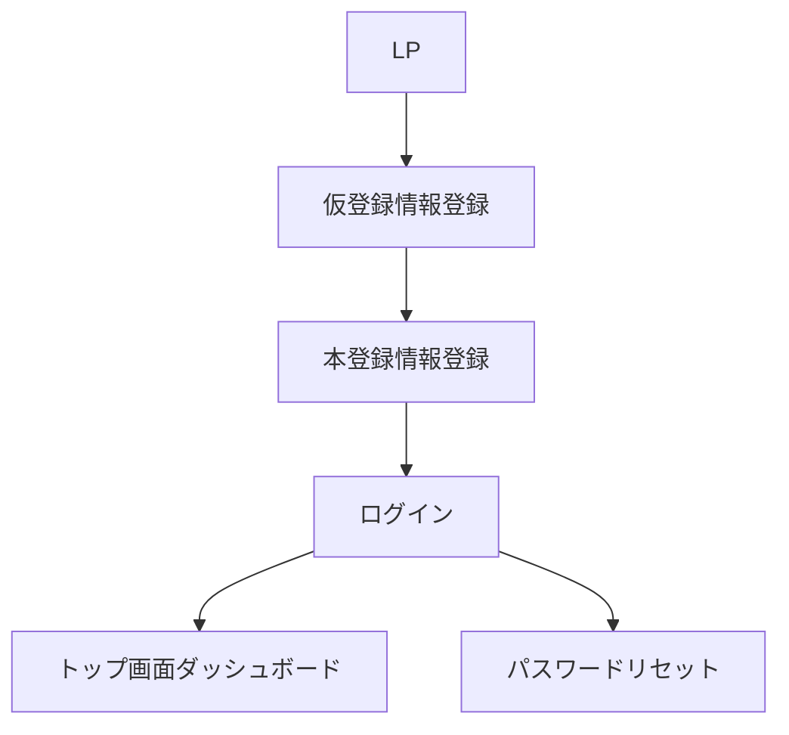
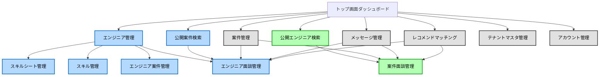
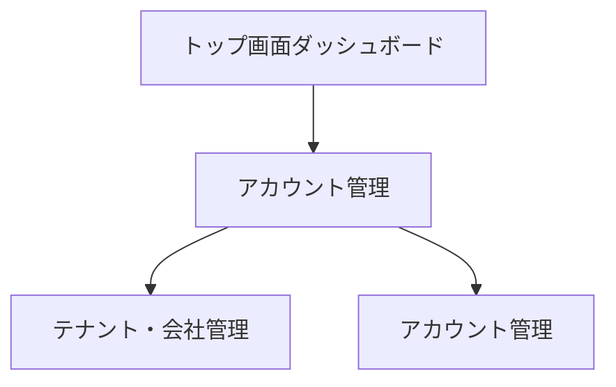
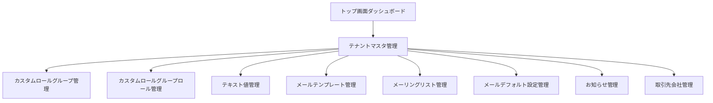
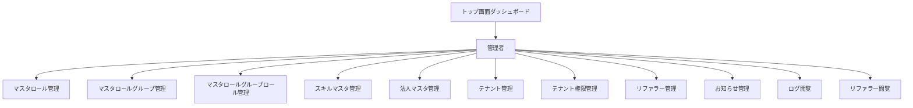

# 基本画面構成

## 概要

本ドキュメントは、`00_機能一覧.md`の「画面グループ一覧」からブレインストーミングした基本画面構成をまとめたものです。各画面グループについて、必要な画面とその目的、主要な要素、遷移先などを記載します。

## 画面遷移図

### ログイン前・認証・認可

### ユーザ

#### トップ画面

#### アカウント管理

#### テナントマスタ管理

### 管理者

