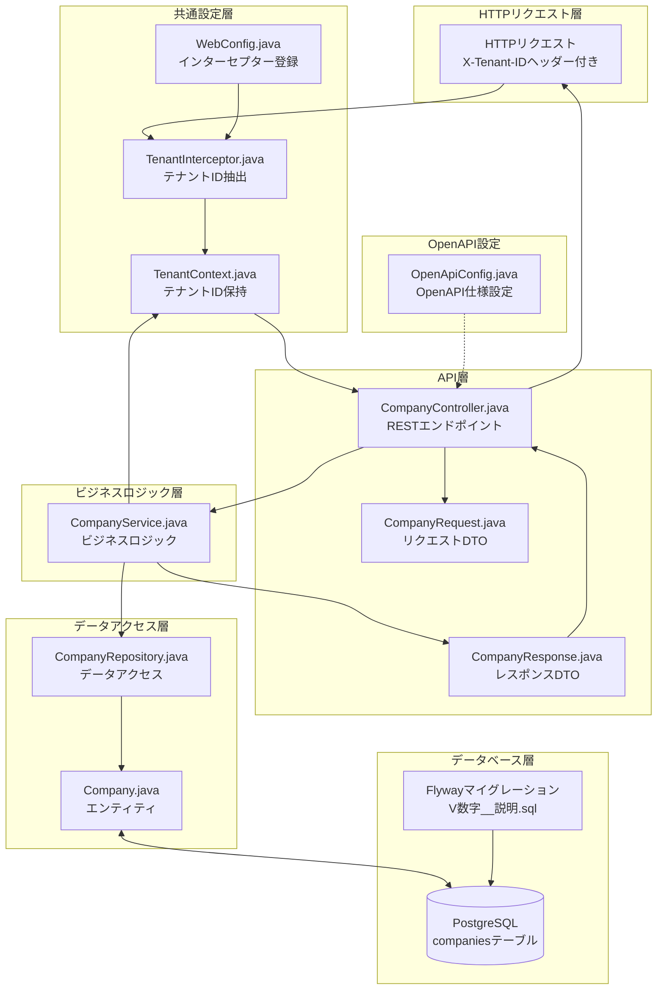
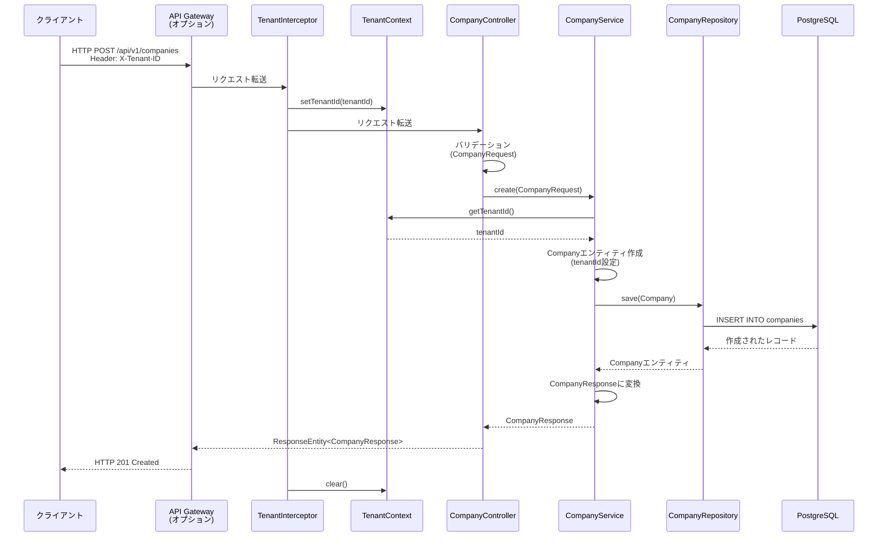

# API開発ガイド

このドキュメントでは、エンジニア・案件マッチングシステム（chktn）におけるAPI開発の手順を説明します。

## 目次

1. [プロジェクト構成](#プロジェクト構成)
2. [ファイル構成とデータフロー](#ファイル構成とデータフロー)
3. [CRUD実装手順](#crud実装手順)
4. [マルチテナント対応の実装方法](#マルチテナント対応の実装方法)
5. [OpenAPI仕様の作成方法](#openapi仕様の作成方法)
6. [Apidogとの連携](#apidogとの連携)
7. [動作確認方法](#動作確認方法)

## プロジェクト構成

### ディレクトリ構造

```
core-service/src/main/java/jp/chokutuna/core/
├── common/              # 共通機能
│   ├── config/         # 設定クラス
│   ├── database/       # データベース関連
│   ├── multitenant/    # マルチテナント対応
│   └── security/       # セキュリティ
├── company/            # Companyモジュール（例）
│   ├── controller/     # RESTコントローラー
│   ├── domain/         # エンティティ・リポジトリ
│   ├── dto/            # DTO
│   └── service/        # サービス層
└── {module}/           # その他のモジュール
```

### レイヤー構成

- **Controller層**: REST APIエンドポイント（`@RestController`）
- **Service層**: ビジネスロジック（`@Service`）
- **Repository層**: データアクセス（`JpaRepository`継承）
- **Domain層**: エンティティ（`@Entity`）
- **DTO層**: データ転送オブジェクト（リクエスト/レスポンス）

## ファイル構成とデータフロー

### アーキテクチャ図

以下の図は、APIリクエストからデータベースまでのデータフローと各ファイルの関係を示しています。



### データフロー（シーケンス図）

リクエスト処理の流れを時系列で示します。



### 各ファイルの役割と説明

#### 共通設定層

| ファイル | 役割 | 説明 |
|---------|------|------|
| **WebConfig.java** | インターセプター登録 | Spring MVCの設定クラス。`TenantInterceptor`を`/api/**`パスに登録し、すべてのAPIリクエストに対してテナントID抽出処理を実行します。 |
| **TenantInterceptor.java** | テナントID抽出 | HTTPリクエストの`X-Tenant-ID`ヘッダーからテナントIDを抽出し、`TenantContext`に設定します。リクエスト処理完了後はテナントIDをクリアします。 |
| **TenantContext.java** | テナントID保持 | ThreadLocalを使用してスレッドごとにテナントIDを保持します。Service層からテナントIDを取得する際に使用します。 |
| **OpenApiConfig.java** | OpenAPI仕様設定 | Swagger UIとOpenAPI仕様の生成設定を行います。API情報、サーバーURL、セキュリティスキーム（`X-Tenant-ID`ヘッダー）を定義します。 |

#### API層（Controller/DTO）

| ファイル | 役割 | 説明 |
|---------|------|------|
| **CompanyController.java** | RESTエンドポイント | REST APIのエンドポイントを定義します。HTTPリクエストを受け取り、Service層を呼び出し、レスポンスを返します。`@Tag`、`@Operation`、`@ApiResponse`アノテーションでOpenAPI仕様を定義します。 |
| **CompanyRequest.java** | リクエストDTO | リクエストボディのデータ構造を定義します。`@Valid`アノテーションと組み合わせてバリデーション（`@NotBlank`、`@Size`、`@Email`など）を実行します。エンティティの内部構造を外部に公開しないようにする役割もあります。 |
| **CompanyResponse.java** | レスポンスDTO | レスポンスボディのデータ構造を定義します。エンティティの全フィールドを返すのではなく、必要な情報のみを返すように設計します。`createdAt`、`updatedAt`などの監査情報も含みます。 |

#### ビジネスロジック層

| ファイル | 役割 | 説明 |
|---------|------|------|
| **CompanyService.java** | ビジネスロジック | ビジネスロジックを実装します。`TenantContext`からテナントIDを取得し、テナントIDによるデータフィルタリングを保証します。DTOとエンティティの変換（`toResponse`メソッド）も行います。`@Transactional`アノテーションでトランザクション管理を行います。 |

#### データアクセス層

| ファイル | 役割 | 説明 |
|---------|------|------|
| **CompanyRepository.java** | データアクセス | Spring Data JPAのリポジトリインターフェースです。`findByTenantId`、`findByIdAndTenantId`などのメソッドでテナントIDによるデータフィルタリングを実現します。`@Query`アノテーションでカスタムクエリも定義できます。 |
| **Company.java** | エンティティ | JPAエンティティクラスです。データベーステーブル（`companies`）とマッピングされます。`@Entity`、`@Table`、`@Column`アノテーションでテーブル構造を定義します。`createdAt`、`updatedAt`はデータベース側で自動設定されるため、`insertable = false, updatable = false`で読み取り専用にしています。 |

#### データベース層

| ファイル | 役割 | 説明 |
|---------|------|------|
| **Flywayマイグレーション<br/>V{timestamp}__*.sql** | データベーススキーマ定義 | Flywayを使用したデータベースマイグレーションファイルです。テーブル作成、インデックス作成、初期データ投入などを行います。ファイル名は`V{timestamp}__{description}.sql`形式で、タイムスタンプ順に実行されます。すべてのテーブルに`tenant_id`カラムを追加し、マルチテナント対応を実現します。 |

### データフローのポイント

1. **テナントIDの流れ**: HTTPヘッダー → `TenantInterceptor` → `TenantContext` → `Service` → `Repository` → データベースクエリ
2. **データ変換の流れ**: HTTPリクエスト → `CompanyRequest` → `Service` → `Company`エンティティ → データベース → `Company`エンティティ → `CompanyResponse` → HTTPレスポンス
3. **マルチテナントフィルタリング**: `Service`層で`TenantContext`からテナントIDを取得し、`Repository`のメソッドに渡すことで、他テナントのデータにアクセスできないことを保証します。

## CRUD実装手順

### 1. データベースマイグレーション作成

Flywayを使用してデータベースマイグレーションファイルを作成します。

**ファイル名形式**: `V{timestamp}__{description}.sql`

**例**: `V20251106091528__create_companies_table.sql`

```sql
-- テーブル作成
CREATE TABLE companies (
    id BIGSERIAL PRIMARY KEY,
    tenant_id VARCHAR(255) NOT NULL,
    name VARCHAR(255) NOT NULL,
    -- その他のカラム
    created_at TIMESTAMP NOT NULL DEFAULT CURRENT_TIMESTAMP,
    updated_at TIMESTAMP NOT NULL DEFAULT CURRENT_TIMESTAMP
);

-- インデックス作成
CREATE INDEX idx_companies_tenant_id ON companies(tenant_id);
```

**注意事項**:
- すべてのテーブルに`tenant_id`カラムを追加（マスタテーブル除く）
- `is_public`カラムでテナント間データ共有を制御
- `created_at`と`updated_at`で監査情報を記録

### 2. エンティティ作成

JPAエンティティを作成します。

**ファイル**: `{module}/domain/{Entity}.java`

```java
@Entity
@Table(name = "companies")
@Data
@Builder
@NoArgsConstructor
@AllArgsConstructor
public class Company {
    @Id
    @GeneratedValue(strategy = GenerationType.IDENTITY)
    private Long id;
    
    @Column(name = "tenant_id", nullable = false)
    private String tenantId;
}
```

### 3. リポジトリ作成

Spring Data JPAリポジトリを作成します。

**ファイル**: `{module}/domain/{Entity}Repository.java`

```java
@Repository
public interface CompanyRepository extends JpaRepository<Company, Long> {
    // テナントIDで検索
    List<Company> findByTenantId(String tenantId);
    
    // テナントIDとIDで検索
    Optional<Company> findByIdAndTenantId(Long id, String tenantId);
    
    // 公開データ検索
    @Query("SELECT c FROM Company c WHERE c.isPublic = true")
    List<Company> findPublicCompanies();
}
```

### 4. DTO作成

リクエストとレスポンスのDTOを作成します。

**リクエストDTO**: `{module}/dto/{Entity}Request.java`

```java
@Data
public class CompanyRequest {
    @NotBlank(message = "会社名は必須です")
    @Size(max = 255)
    private String name;
    
    @Size(max = 1000)
    private String address;
    
    @Email
    private String email;
    
    private Boolean isPublic;
}
```

**レスポンスDTO**: `{module}/dto/{Entity}Response.java`

```java
@Data
@Builder
@NoArgsConstructor
@AllArgsConstructor
public class CompanyResponse {
    private Long id;
    private String tenantId;
    private String name;
    private String address;
    private String email;
    private Boolean isPublic;
    private LocalDateTime createdAt;
    private LocalDateTime updatedAt;
}
```

### 5. サービス層作成

ビジネスロジックを実装します。

**ファイル**: `{module}/service/{Entity}Service.java`

```java
@Service
@RequiredArgsConstructor
public class CompanyService {
    private final CompanyRepository companyRepository;
    
    @Transactional(readOnly = true)
    public List<CompanyResponse> findAll() {
        String tenantId = TenantContext.getTenantId();
        if (tenantId == null) {
            throw new IllegalStateException("テナントIDが設定されていません");
        }
        
        return companyRepository.findByTenantId(tenantId).stream()
            .map(this::toResponse)
            .collect(Collectors.toList());
    }
    
    @Transactional
    public CompanyResponse create(CompanyRequest request) {
        String tenantId = TenantContext.getTenantId();
        // 作成処理
    }
    
    private CompanyResponse toResponse(Company company) {
        return CompanyResponse.builder()
            .id(company.getId())
            .tenantId(company.getTenantId())
            // その他のフィールド
            .build();
    }
}
```

### 6. コントローラー作成

REST APIエンドポイントを実装します。

**ファイル**: `{module}/controller/{Entity}Controller.java`

```java
@RestController
@RequestMapping("/api/v1/companies")
@RequiredArgsConstructor
@Tag(name = "Company", description = "会社管理API")
public class CompanyController {
    private final CompanyService companyService;
    
    @GetMapping
    @Operation(summary = "会社一覧取得", description = "自社の会社一覧を取得します")
    @ApiResponse(responseCode = "200", description = "取得成功")
    public ResponseEntity<List<CompanyResponse>> findAll() {
        List<CompanyResponse> companies = companyService.findAll();
        return ResponseEntity.ok(companies);
    }
    
    @PostMapping
    @Operation(summary = "会社作成", description = "新しい会社を作成します")
    @ApiResponses({
        @ApiResponse(responseCode = "201", description = "作成成功"),
        @ApiResponse(responseCode = "400", description = "バリデーションエラー")
    })
    public ResponseEntity<CompanyResponse> create(
            @Valid @RequestBody CompanyRequest request) {
        CompanyResponse company = companyService.create(request);
        return ResponseEntity.status(HttpStatus.CREATED).body(company);
    }
    
    // その他のエンドポイント（GET/{id}, PUT/{id}, DELETE/{id}）
}
```

## マルチテナント対応の実装方法

### テナントIDの取得

HTTPヘッダー`X-Tenant-ID`からテナントIDを取得します。

**実装済み機能**:
- `TenantInterceptor`: HTTPヘッダーからテナントIDを取得して`TenantContext`に設定
- `TenantContext`: ThreadLocalを使用してテナントIDを保持
- `WebConfig`: インターセプターを登録

**使用方法**:

```java
// Service層でテナントIDを取得
String tenantId = TenantContext.getTenantId();
if (tenantId == null) {
    throw new IllegalStateException("テナントIDが設定されていません");
}
```

### データフィルタリング

リポジトリでテナントIDによるフィルタリングを実装します。

```java
// 自社のデータのみ取得
List<Company> findByTenantId(String tenantId);

// テナントIDとIDで検索（他テナントのデータにアクセスできないことを保証）
Optional<Company> findByIdAndTenantId(Long id, String tenantId);
```

### 公開データの取得

`is_public`フラグを使用してテナント間データ共有を実装します。

```java
// 公開されているデータを全テナントから取得
@Query("SELECT c FROM Company c WHERE c.isPublic = true")
List<Company> findPublicCompanies();

// 自社のデータ + 公開データを取得
@Query("SELECT c FROM Company c WHERE c.tenantId = :tenantId OR c.isPublic = true")
List<Company> findByTenantIdOrPublic(@Param("tenantId") String tenantId);
```

## OpenAPI仕様の作成方法

### 基本設定

`OpenApiConfig.java`でOpenAPIの基本設定を行います。

```java
@Configuration
public class OpenApiConfig {
    @Bean
    public OpenAPI customOpenAPI() {
        return new OpenAPI()
            .info(new Info()
                .title("Core Service API")
                .version("1.0.0")
                .description("エンジニア・案件マッチングシステム Core Service API"))
            .servers(List.of(
                new Server().url("http://localhost:8081")
                    .description("Local Development Server (Core Service)"),
                new Server().url("http://localhost:8080")
                    .description("Local Development Server (API Gateway)")
            ));
    }
}
```

**注意**: `X-Tenant-ID`ヘッダーは、OpenAPI仕様ではセキュリティスキームとして定義せず、通常のヘッダーとして扱います。ApidogなどのAPIクライアントツールで、グローバルヘッダーとして設定してください。これにより、Apidogが自動生成する変数名（`apiKey`など）との競合を避けることができます。

### コントローラーへのアノテーション追加

```java
@RestController
@RequestMapping("/api/v1/companies")
@Tag(name = "Company", description = "会社管理API")
public class CompanyController {
    
    @GetMapping
    @Operation(summary = "会社一覧取得", description = "自社の会社一覧を取得します")
    @ApiResponse(responseCode = "200", description = "取得成功")
    public ResponseEntity<List<CompanyResponse>> findAll() {
        // 実装
    }
    
    @PostMapping
    @Operation(summary = "会社作成", description = "新しい会社を作成します")
    @ApiResponses({
        @ApiResponse(responseCode = "201", description = "作成成功"),
        @ApiResponse(responseCode = "400", description = "バリデーションエラー")
    })
    public ResponseEntity<CompanyResponse> create(
            @Parameter(description = "会社ID", required = true, example = "1")
            @PathVariable Long id,
            @io.swagger.v3.oas.annotations.parameters.RequestBody(
                    description = "会社情報",
                    required = true,
                    content = @Content(schema = @Schema(implementation = CompanyRequest.class))
            )
            @Valid @RequestBody CompanyRequest request) {
        // 実装
    }
}
```

### OpenAPI仕様の確認

**Swagger UI**: `http://localhost:8081/swagger-ui.html`

**OpenAPI JSON**: `http://localhost:8081/v3/api-docs`

**OpenAPI YAML**: `http://localhost:8081/v3/api-docs.yaml`

## Apidogとの連携

### 1. OpenAPI仕様のエクスポート

#### 方法1: ブラウザから直接ダウンロード

1. ブラウザで `http://localhost:8081/v3/api-docs` にアクセス
2. JSONファイルをダウンロード
3. ファイル名を `openapi.json` に変更（任意）

#### 方法2: curlコマンドで取得

```bash
# JSON形式で取得
curl -o openapi.json http://localhost:8081/v3/api-docs

# YAML形式で取得（YAML形式が利用可能な場合）
curl -o openapi.yaml http://localhost:8081/v3/api-docs.yaml
```

#### 方法3: Swagger UIからエクスポート

1. `http://localhost:8081/swagger-ui.html` にアクセス
2. 右上の「Download」ボタンをクリック
3. OpenAPI JSONをダウンロード

### 2. Apidogへのインポート

#### 手順1: Apidogを開く

1. Apidogアプリケーションを起動
2. プロジェクトを開く（または新規作成）

#### 手順2: OpenAPI仕様をインポート

**方法A: ファイルからインポート**

1. メニューから「インポート」→「OpenAPI」を選択
2. ダウンロードした`openapi.json`ファイルを選択
3. インポート設定を確認
   - 環境変数の設定（`X-Tenant-ID`など）
   - サーバーURLの設定
4. 「インポート」をクリック

**方法B: URLからインポート**

1. メニューから「インポート」→「URLからインポート」を選択
2. URLを入力: `http://localhost:8081/v3/api-docs`
3. 「インポート」をクリック

**方法C: コマンドラインからインポート（Apidog CLI使用時）**

```bash
# Apidog CLIがインストールされている場合
apidog import openapi.json
```

### 3. 環境変数の設定

Apidogで環境変数を設定します。

**環境変数の設定**:

1. Apidogの「環境」タブを開く
2. 環境変数を追加:
   - 変数名: `tenantId`
   - デフォルト値: `tenant-001`
   - スコープ: グローバルまたはプロジェクト

**ヘッダーの設定**:

1. リクエストの「ヘッダー」タブを開く
2. ヘッダーを追加:
   - 名前: `X-Tenant-ID`
   - 値: `{{tenantId}}`（環境変数を参照）

### 4. サーバーURLの設定

ApidogでサーバーURLを設定します。

**設定方法**:

1. 「環境」タブを開く
2. サーバーURLを設定:
   - 開発環境: `http://localhost:8080`（API Gateway経由）
   - または直接: `http://localhost:8081`（Core Service直接）

### 5. 動作確認

1. ApidogでAPIリクエストを送信
2. レスポンスを確認
3. 必要に応じて環境変数を変更して再テスト

### 注意事項

- **テナントIDヘッダー**: すべてのリクエストに`X-Tenant-ID`ヘッダーが必要
- **サーバーURL**: API Gateway経由（8080）またはCore Service直接（8081）を選択
- **OpenAPI仕様の更新**: コード変更後はOpenAPI仕様を再エクスポートしてApidogに再インポート

## 動作確認方法

### 1. ビルド確認

```bash
# プロジェクト全体をビルド
./gradlew build

# 特定のモジュールをビルド
./gradlew :core-service:build
```

### 2. Docker起動

```bash
# すべてのサービスを起動
docker compose up -d

# 特定のサービスを再ビルドして起動
docker compose up -d --build core-service

# ログ確認
docker compose logs core-service --tail 50
```

### 3. API動作確認

#### curlコマンドでの確認

```bash
# 会社一覧取得
curl -X GET "http://localhost:8080/api/v1/companies" \
  -H "X-Tenant-ID: tenant-001" \
  -H "Content-Type: application/json"

# 会社作成
curl -X POST "http://localhost:8080/api/v1/companies" \
  -H "X-Tenant-ID: tenant-001" \
  -H "Content-Type: application/json" \
  -d '{
    "name": "テスト会社",
    "address": "東京都渋谷区",
    "phone": "03-1234-5678",
    "email": "test@example.com",
    "isPublic": false
  }'

# 会社取得
curl -X GET "http://localhost:8080/api/v1/companies/1" \
  -H "X-Tenant-ID: tenant-001" \
  -H "Content-Type: application/json"

# 会社更新
curl -X PUT "http://localhost:8080/api/v1/companies/1" \
  -H "X-Tenant-ID: tenant-001" \
  -H "Content-Type: application/json" \
  -d '{
    "name": "更新された会社",
    "address": "東京都新宿区",
    "phone": "03-9999-8888",
    "email": "updated@example.com",
    "isPublic": true
  }'

# 会社削除
curl -X DELETE "http://localhost:8080/api/v1/companies/1" \
  -H "X-Tenant-ID: tenant-001" \
  -H "Content-Type: application/json"
```

#### Swagger UIでの確認

1. ブラウザで `http://localhost:8081/swagger-ui.html` にアクセス
2. 各エンドポイントを展開
3. 「Try it out」をクリック
4. パラメータを入力（`X-Tenant-ID`ヘッダーを設定）
5. 「Execute」をクリックして実行

#### Apidogでの確認

1. Apidogでリクエストを作成
2. 環境変数（`tenantId`）を設定
3. リクエストを送信
4. レスポンスを確認

### 4. データベース確認

```bash
# PostgreSQLに接続
docker compose exec postgres psql -U postgres -d chktn_db

# テーブル一覧確認
\dt

# データ確認
SELECT * FROM companies;
```

### 5. エラーハンドリング確認

```bash
# テナントIDなしでリクエスト（エラー確認）
curl -X GET "http://localhost:8080/api/v1/companies" \
  -H "Content-Type: application/json"

# 存在しないIDで取得（404エラー確認）
curl -X GET "http://localhost:8080/api/v1/companies/999" \
  -H "X-Tenant-ID: tenant-001" \
  -H "Content-Type: application/json"
```

## まとめ

このガイドに従って実装することで、以下のことが実現できます：

1. **標準的なCRUD API**の実装
2. **マルチテナント対応**の実装
3. **OpenAPI仕様**の自動生成
4. **Apidogとの連携**によるAPIテスト

今後、新しいモジュール（Engineer、Project等）を追加する際も、同様の手順で実装できます。

